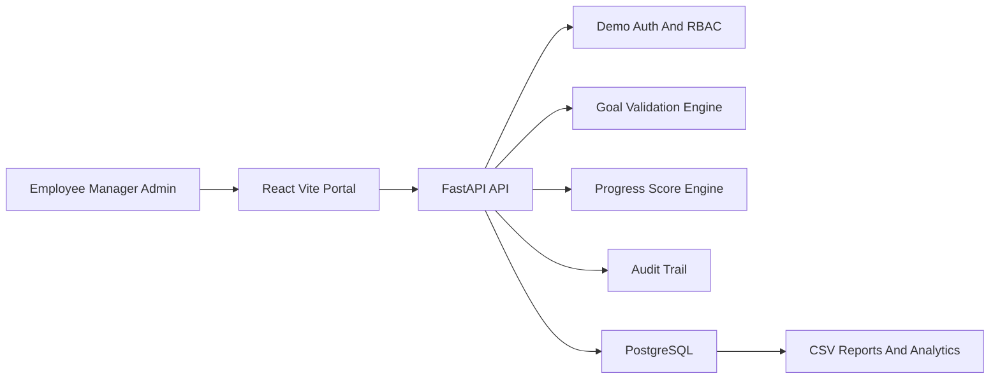

# AtomQuest GoalTrack Portal - Single Page Submission

## Solution Summary

GoalTrack is a browser-based goal setting and tracking portal for Employee, Manager, and Admin/HR personas. It digitizes the full lifecycle from goal drafting and L1 approval to quarterly achievement capture, manager check-ins, completion dashboards, CSV reporting, and audit-ready exception handling.

## Architecture

## Tech Stack

- React + TypeScript + Recharts: polished role-based UI, charts, and fast free-tier deployment on Vercel.
- FastAPI + Pydantic: reliable APIs, validation, clean OpenAPI docs, and rapid Python development.
- SQLAlchemy + PostgreSQL: normalized workflow data model, audit trail, reporting queries, and production-ready persistence.
- Render/Railway + Vercel: near-zero-cost hosting with simple deployment and environment configuration.

## Backend Data Model

Core tables: users, cycles, goal_sheets, goals, shared_goal_groups, achievements, checkins, audit_logs.

The design separates planned targets from quarterly actuals, allowing accurate Planned vs Actual reports, progress scoring, check-in completion tracking, and audit logging for governance.

## BRD Coverage

- Employee goal creation with thrust area, title, description, UoM, target, and weightage.
- Validation rules: total 100%, minimum 10%, maximum 8 goals.
- L1 approval workflow with inline target and weightage edits, return for rework, approval, and lock.
- Shared goals pushed to multiple employees with read-only KPI fields for recipients.
- Quarterly achievement entry, status tracking, progress score formulas, and manager comments.
- Admin dashboard, cycle control API, exception unlock, audit trail, and CSV achievement export.

## Cost Optimization

The solution uses one API service, one PostgreSQL database, and a static frontend. No paid queues, external identity provider, email service, or streaming cluster is required for the hackathon demo. The architecture remains extensible for Microsoft Entra ID, Teams notifications, and escalation jobs after MVP validation.

## Demo Flow

1. Employee logs in, edits goals, validates weightage, and submits the sheet.
2. Manager reviews, edits targets or weightage inline, approves and locks the sheet.
3. Employee enters Q1 actual achievement and status.
4. Manager completes a check-in comment.
5. Admin views completion analytics, downloads the achievement CSV, reviews audit logs, and unlocks exceptions.
